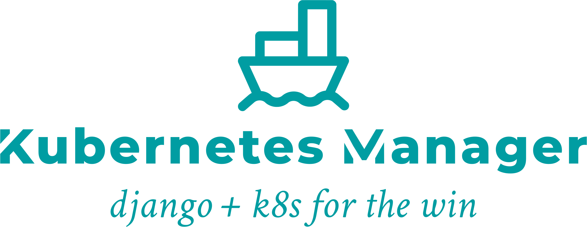

Django Kubernetes Manager is an open source project to wrap the complexity of Kubernetes management in the simplicity of Django Rest Framework.

Introduction
-------------

Our engineering team has developed several data processing apps, and
found celery wasn't quite enough for dispatching heavier tasks.
We decided to try Kubernetes Jobs, and while pleased with performance,
wanted a less verbose, more object oriented way to interact with our clusters.

And thus Django Kubernetes Manager was spawned. Using Django Rest Framework and
the kubernetes client library, our devs came up with the idea to treat each object
we'd be deploying as a Model instance, and use the DRF viewsets and actions to
create an RESTful API framework from which we could extend for each projects
particular needs.

License
--------
This project is license under the MIT license.

Please see the license dir for dependency licenses.

Docs
-------
ReadTheDocs_

.. _ReadTheDocs: https://django-kubernetes-manager.readthedocs.io/en/latest/index.html

Installation
---------------
Install the app using pip::

  $ pip install django-kubernetes-manager

Getting Started
---------------
1. Add "django_kubernetes_manager" to your INSTALLED_APPS setting like this::

    INSTALLED_APPS = [
        ...
        'django_kubernetes_manager',
    ]

2. Include the django_kubernetes_manager URLconf in your project urls.py like this::

    path('dkm/', include('django_kubernetes_manager.urls')),

3. To create models in your database, run::

    python manage.py migrate

    * Requires Postgresql or other database with JSON support.

4. Start the development server and visit http://127.0.0.1:8000/admin/
   to configure a TargetCluster (you'll need the Admin app enabled).

5. Create, update, delete, deploy, or remove a Kubernetes object
   using the api :)
